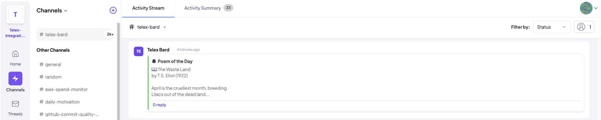
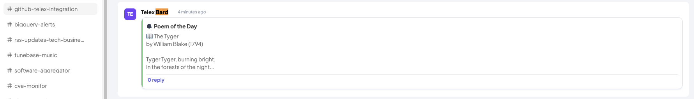

# Telex Bard

## **Project Overview**
Telex Bard is an Interval Integration for Telex that delivers a 'Poem of the Day' from a predefined collection at a specific time every day. This integration is developed using **Node.js** and integrates seamlessly with the **Telex API** to post messages automatically.

---

## **Key Features**
- Automatically selects and posts a random poem to a Telex channel daily.
- Uses the **Telex Messages API** to deliver the poems.
- Configured to run at **8 AM every evening** using Interval cron scheduling.
- Implements **Bearer Token Authentication** for secure API access.

---

## **Tech Stack**
- **Node.js** - Backend server.
- **Express.js** - API routing.
- **Axios** - HTTP client for external API calls.
- **Interval** - Task scheduling.
- **dotenv** - Environment variable management.

---

##  **Setup Instructions**

### 1. **Clone the Repository:**
```sh
git clone https://github.com/majuyitan/telex-bard.git
cd telex-bard
```

### 2. **Install Dependencies:**
```sh
npm install
```

### 3. **Environment Variables:**
Create a `.env` file in the root directory and add:
```plaintext
PORT=PORT
TELEX_WEBHOOK_URL=https://ping.telex.im/v1/webhooks/YOUR-WEBHOOK-ID
```

Replace `YOUR-WEBHOOK-ID` with your actual Telex webhook ID.

### 4. **Run the Server:**
```sh
npm start
```

### 5. **Test the Endpoint:**
Use Postman or any API testing tool to **POST** to `http://localhost:3000/tick`.

### 6. **Run Tests:**
```sh
npm test
```

---

## **How It Works**
- `tick.js` is the main route that triggers the poem delivery.
- It fetches a random poem using the `getRandomPoem()` utility.
- Sends the poem to the Telex channel using the **Telex Messages API**.
- Scheduled to run automatically at **8 AM daily**.

---

## **Testing**

- Simply push to the repository or open a pull request to trigger a unit test.



Get logged in to the `telex-bard` or `github-telex-integration` channels on Telex test organization to view the activity of Telex Bard live in real-time

---

## **Project Structure**
```
├── public
│   └── quill.png
├── src
│   ├── app.js
│   ├── poems.json
│   ├── routes
│   │   ├── index.js
│   │   ├── integration.js
│   │   └── tick.js        # Endpoint to trigger poem sending
│   └── utils
│       └── getRandomPoem.js # Poem selection logic
├── .env                   # Environment variables
├── package.json           # Project metadata & dependencies
├── package-lock.json
├── server.js              # Server entry point
└── README.md              # Project documentation
```

## **API Endpoints**

### **Health Check**
```http
GET /health
```
- **Response:** `{ "status": "Healthy" }`

### **Integration Info**
```http
GET /api/integration
```
- **Response:** Provides metadata for Telex integration.

### **Tick Endpoint**
```http
POST /tick
```
- **Request Body:**
```json
{
    "return_url": "https://your-webhook-url.com",
    "settings": [
        {
            "label": "interval",
            "default": "0 8 * * *"
        }
    ]
}
```

---

## **Future Improvements**
- Add more advanced scheduling options.
- Implement error handling and retries for API requests.
- Expand the poem collection dynamically from external sources.

---

## Contributing

1. **Fork the repository**.

2. **Create a feature branch**:

```bash
git checkout -b feature/YourFeatureName
```

3. **Commit your changes**:

```bash
git commit -m 'Add YourFeatureName'
```

4. **Push to the branch**:

```bash
git push origin feature/YourFeatureName
```

5. **Open a Pull Request**.

---

## License

This project is licensed under the MIT License. See the [LICENSE](LICENSE) file for details.

---

## Support

For support, please open an issue in the GitHub repository.
